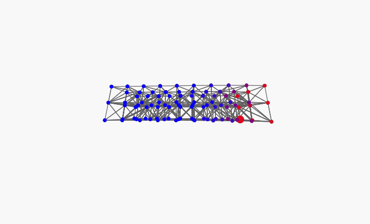

# ORFAS
### Open Rust Framework Architecture for Simulation

[](https://opensource.org/licenses/Apache-2.0)
[]()
[](https://www.rust-lang.org/)
[]()

> *A generic, extensible Finite Element Method framework written in Rust, with a primary focus on medical and biomechanical simulation.*

---

---

## Abstract

ORFAS is an open-source framework for physics-based simulation using the Finite Element Method (FEM),
implemented in Rust. It provides a modular, composable architecture designed to support a wide range
of material laws, element types, and numerical solvers. While the framework is domain-agnostic, its
primary design motivation is soft tissue simulation for medical and surgical applications, in the
tradition of projects such as SOFA.

ORFAS is built on three foundational principles: **genericity** (material laws, solvers, and element
types are interchangeable via traits), **extensibility** (each component can be replaced or augmented
without modifying the core), and **performance** (Rust's ownership model and zero-cost abstractions
enable safe, high-performance numerical computation without a garbage collector).

This project is in active early development. The current milestone targets a dynamic 3D FEM solver
with nonlinear hyperelastic materials on tetrahedral meshes and implicit Euler time integration with
Newton-Raphson. Contributions, feedback, and collaborations are warmly welcomed.

---

## Motivation

### Why a new simulation framework?

Existing FEM frameworks for medical simulation are predominantly written in C++ (SOFA, FEBio, deal.II).
While mature and capable, these frameworks carry significant adoption friction: complex CMake build
systems, heavy dependency chains, and architectures designed before modern concurrency and memory
safety were first-class concerns.

Rust offers a compelling alternative: memory safety without a garbage collector, a world-class
package manager (Cargo), and a trait system that enables generic programming with compile-time
guarantees. These properties are particularly valuable in simulation code, where subtle memory
bugs and performance regressions are costly.

### Why not extend SOFA or Fenris?

[SOFA](https://www.sofa-framework.org/) is the reference framework for medical simulation and a
direct source of inspiration for ORFAS. However, its C++ codebase and plugin architecture present
a high integration barrier for projects seeking a modern, memory-safe foundation.

[Fenris](https://github.com/InteractiveComputerGraphics/fenris) is the most mature FEM library in
the Rust ecosystem and an excellent piece of work. Its focus is solid mechanics for computer graphics,
and it is no longer actively maintained as of 2022. ORFAS targets a different domain (medical
simulation) and a different design philosophy (full replaceability of every numerical component
via traits).

### Long-term vision

ORFAS aims to become a reference implementation for FEM-based medical simulation in Rust, providing:
- Native Rust performance and safety guarantees
- Python bindings for the scientific computing community (via PyO3)
- WebAssembly support for browser-based simulation and visualization
- A path toward real-time surgical simulation and haptic feedback

---

## Architecture

ORFAS is organized as a Cargo workspace with three crates:

```
orfas/
├── orfas-core/     # Core library: mesh, materials, assembly, solvers, integrators
├── orfas-io/       # Mesh I/O: .vtk file format
└── orfas-viewer/   # Interactive viewer (egui)
```

### orfas-viewer structure

The viewer is organized as a set of focused modules:

```
orfas-viewer/src/
├── main.rs        # Entry point only
├── app.rs         # MyEguiApp, impl eframe::App, all UI logic
├── state.rs       # AppState, Camera, enums, make_material
├── simulation.rs  # build_simulation, run_simulation_static, init_simulation_dynamic
└── render.rs      # project, screen_to_node, depth_sorted_nodes
```

### Core abstractions (`orfas-core`)

The framework is built around several central traits:

**`MaterialLaw`** — Defines the constitutive relationship between strain and stress in the Lagrangian
frame. Any hyperelastic material model (Saint Venant-Kirchhoff, Neo-Hookean, ...) implements this
trait via three methods: `pk2_stress(F)`, `tangent_stiffness(F)`, and `strain_energy(F)`. Swapping
material laws requires no changes to the assembly or solver.

**`BoundaryConditionMethod`** — Defines how Dirichlet boundary conditions are applied to the system.
Current implementations: penalty method and elimination method.

**`DenseSolver`** — Solves the assembled dense linear system `K·u = f`.
Current implementation: `DirectSolver` — direct LU decomposition via nalgebra.

**`SparseSolver`** — Solves the assembled sparse linear system `K·u = f` (via `CsrMatrix`).
Current implementation: `CgSolver` — preconditioned conjugate gradient with `Identity` or `ILU(0)` preconditioner.

**`NonlinearSolver`** — Solves the nonlinear static problem `R(u) = f_int(u) - f_ext = 0` using dense assembly.
Current implementations: `NewtonRaphson` (reassembles K at each iteration) and
`NewtonRaphsonCachedK` (factorizes K once, for materials with constant tangent stiffness such as SVK).

**`NonlinearSparseSolver`** — Solves the same nonlinear static problem using sparse assembly (`CsrMatrix`).
Current implementation: `NewtonRaphsonSparse` — preferred for large meshes (> 1000 nodes).

**`DampingModel`** — Defines how the damping matrix `C` is computed from the mass and stiffness matrices.
Current implementation: Rayleigh damping `C = α·M + β·K`.

**`IntegratorMethod`** — Defines a time integration scheme advancing the `MechanicalState` by one step `dt`.
Current implementation: implicit Euler with internal Newton-Raphson loop, supporting nonlinear materials.

**`MechanicalState`** — Holds the dynamic state of the simulated object: position, velocity, and acceleration vectors.
Exposes vector operations (`v_op`, `add_mv`) inspired by SOFA's `MechanicalState` abstraction.

---

## Changelog

### v0.6.1
- **`SparseAssemblyStrategy` trait** — generic assembly strategy for `NewtonRaphsonSparse`; two implementations: `Sequential` (existing) and `Parallel` (new)
- **`NewtonRaphsonSparse<S: SparseAssemblyStrategy>`** — refactored to be generic over the assembly strategy; zero code duplication between sequential and parallel variants
- **`assemble_tangent_sparse_parallel`** — parallel sparse assembly via rayon + atomic f64 additions (`fetch_update`); ~10x speedup on meshes > 8000 nodes (measured on 20-core machine)
- **Pre-built CSR pattern** in `Assembler` — sparsity pattern computed once at `Assembler::new` via `build_csr_pattern`; reused at every assembly call; eliminates COO→CSR sorting overhead
- **`entry_map`** — `HashMap<(i,j), idx>` cached at `Assembler::new`; enables O(1) direct write into CSR values array per element
- **`build_element_colors`** — greedy graph coloring of elements (available, unused); stored as `Option<Vec<Vec<usize>>>` in `Assembler` for future use
- **Viewer** — `SolverChoice::NewtonSparseParallel` added; selectable as "Newton (sparse CG parallel)" in the UI
- **`assemble_internal_forces_parallel`** — evaluated and abandoned; assembly too fast (~11ms) for rayon overhead to pay off on any mesh size tested

### v0.6.0
- **Sparse solvers** (`orfas-core/src/sparse.rs`) — new module providing sparse linear and nonlinear solvers
- **`SparseSolver` trait** — mirror of `DenseSolver` operating on `CsrMatrix<f64>` (nalgebra-sparse)
- **`CgSolver`** — preconditioned conjugate gradient solver; supports `Preconditioner::Identity` and `Preconditioner::Ilu(k)`
- **`ILU(0)` preconditioner** — incomplete LU factorization with zero fill-in; implemented from scratch using a sparse row buffer strategy; includes `forward_substitution` and `backward_substitution` for triangular solves
- **`assemble_tangent_sparse`** — new sparse assembly method on `Assembler`, building a `CsrMatrix` via COO accumulation; pattern not precalculated, entries pushed per element
- **`NonlinearSparseSolver` trait** and **`NewtonRaphsonSparse`** — sparse equivalent of `NewtonRaphson`; uses `assemble_tangent_sparse` and `restrict_matrix_sparse` internally
- **`restrict_matrix_sparse`** — filters `CsrMatrix` triplets to free DOFs via `HashMap<global, local>` mapping
- **`DenseSolver` rename** — `Solver` trait renamed to `DenseSolver` for clarity; all existing implementations and call sites updated
- **Viewer** — `SolverChoice::NewtonSparse` added; selectable as "Newton (sparse CG)" in the UI

### v0.5
- **Neo-Hookean hyperelastic material** (`NeoHookean`) — compressible formulation:
  `W = μ/2·(I₁−3) − μ·ln(J) + λ/2·(ln J)²`, with `S = μ(I − C⁻¹) + λ·ln(J)·C⁻¹`
  and full analytical tangent stiffness `C_tangent = dS/dE` depending on `F` — requires K reassembly at each Newton iteration
- **`NewtonRaphsonCachedK`** — Newton-Raphson variant that factorizes `K_tangent` once at `u=0`
  and reuses the LU factorization across all Newton iterations; valid for SVK where `C_tangent` is constant;
  reduces cost from `N×O(n³)` to `O(n³) + N×O(n²)` for `N` Newton iterations
- **Viewer refactored** into 5 focused modules (`app.rs`, `state.rs`, `simulation.rs`, `render.rs`, `main.rs`)
- **Improved camera** — orbit with explicit target point, Shift+drag pan, multiplicative scroll zoom,
  pitch clamp to avoid gimbal flip, auto-focus on mesh bounding box at load/simulate,
  proper view matrix via `right/up/forward` vectors, depth-sorted node rendering (painter's algorithm)
- Neo-Hookean and Newton (cached K) selectable in the viewer UI

### v0.4
- Nonlinear hyperelastic material: `SaintVenantKirchhoff` — replaces `LinearElastic`, reduces to linear elasticity for small deformations
- Fully refactored `MaterialLaw` trait: `pk2_stress(F)`, `tangent_stiffness(F)`, `strain_energy(F)` — all taking the deformation gradient `F` as input
- `NonlinearSolver` trait and `NewtonRaphson` implementation with SOFA-style normalized convergence criteria
- `BoundaryConditionResult::reconstruct_ref` — non-consuming reconstruction for Newton loops
- Nonlinear implicit Euler integrator — Newton-Raphson loop inside the time step; system matrix `A = M/dt + C + dt·K_tangent`

### v0.3
- Dynamic simulation: `MechanicalState` (position, velocity, acceleration as `DVector<f64>`)
- Lumped mass assembly (`assemble_mass`) — 1/4 of element mass per connected node
- Rayleigh damping `C = α·M + β·K`
- Implicit Euler integrator — unconditionally stable, Newton loop for nonlinear materials
- `restrict_matrix` / `restrict_vector` — helpers for extracting free DOFs

### v0.2
- `read_vtk` in `orfas-io` — ASCII VTK parser, state machine, line-by-line
- `EliminationMethod` — reduces system to free DOFs, more stable than penalty
- `FixedNode` with per-axis flags — directional constraints
- `BoundaryConditionResult` — separates reduced and full DOF spaces
- Node inspector in viewer — click to select, toggle fixed, apply force

### v0.1
- Linear tetrahedral elements (CST 3D) with constant strain-displacement matrix B
- Structured mesh generation (`Mesh::generate`)
- Penalty method for zero-displacement boundary conditions
- Direct LU solver
- Interactive egui viewer with 3D perspective projection, rotation, zoom
- Deformed shape visualization with displacement colormap

---

## Roadmap

| Version | Status | Description |
|---------|--------|-------------|
| **v0.1** | ✅ Done | Static 3D FEM, linear elasticity, tetrahedral mesh, direct solver, basic egui viewer |
| **v0.2** | ✅ Done | VTK mesh loading, elimination boundary conditions, per-node forces, interactive node inspector |
| **v0.3** | ✅ Done | Dynamic simulation, implicit Euler time integration, Rayleigh damping, MechanicalState |
| **v0.4** | ✅ Done | Nonlinear materials (SVK), Newton-Raphson solver, nonlinear implicit Euler, refactored MaterialLaw |
| **v0.5** | ✅ Done | Neo-Hookean material, NewtonRaphsonCachedK, viewer refactor, improved camera |
| **v0.6.0** | ✅ Done | **Performance** — sparse solvers (CsrMatrix), conjugate gradient with ILU(0) preconditioner, NewtonRaphsonSparse |
| **v0.6.1** | ✅ Done | **Performance** — parallel sparse assembly (rayon, ~10x speedup), pre-built CSR pattern, SparseAssemblyStrategy trait |
| **v0.7.0** | ⬜ Planned | **Materials** — Mooney-Rivlin, Ogden |
| **v0.7.1** | ⬜ Planned | **Materials** — Holzapfel-Ogden (anisotropic fibers), viscoelastic (Maxwell, Kelvin-Voigt) |
| **v0.7.2** | ⬜ Planned | **Materials** — `orfas-tissues` preset library with nominal values, confidence intervals and literature references; automatic thermodynamic consistency checks (non-negative energy, objectivity, positive-definiteness of tangent) |
| **v0.8.0** | ⬜ Planned | **Elements** — `FiniteElement` trait abstraction, Tet10 (quadratic, reduces shear locking) |
| **v0.8.1** | ⬜ Planned | **Elements** — Hex8, shells, beams |
| **v0.9.0** | ⬜ Planned | **I/O** — VTU/VTK export (ParaView), OBJ/STL/MSH import |
| **v0.9.1** | ⬜ Planned | **I/O** — `.orfas` simulation file format (mesh, material, BCs, solver params, ORFAS version hash, results checksum — designed for scientific reproducibility and publication); per-element field export (stress, strain, energy), force-displacement CSV, structured per-timestep logging |
| **v0.10.0** | ⬜ Planned | **Scientific** — SI unit system via `uom` crate, compile-time unit safety (Pa vs kPa, mm vs m), documented numerical precision per solver |
| **v0.10.1** | ⬜ Planned | **Scientific** — standardized validation metrics (Hausdorff distance, nodal RMSE, force-displacement curve error), parametric sensitivity analysis |
| **v0.10.2** | ⬜ Planned | **Scientific** — automated analytical benchmarks (traction, bending, torsion, internal pressure) with pass/fail reports and convergence curves; numerical regression snapshot testing |
| **v0.11.0** | ⬜ Planned | **Architecture** — stable public trait audit, `SimulationPlugin` trait, static and dynamic plugin loading (`libloading`), `orfas-plugin-template` crate, API versioning with semver |
| **v0.11.1** | ⬜ Planned | **Architecture** — multi-object scene graph, `BarycentricMapping`, `RigidMapping`; prerequisite for multi-body and visual rendering |
| **v0.11.2** | ⬜ Planned | **Architecture** — `.orfas` format extended for full scene graph serialization |
| **v0.12.0** | ⬜ Planned | **Rendering** — OpenGL/wgpu renderer, separate visual mesh from simulation mesh |
| **v0.12.1** | ⬜ Planned | **Rendering** — shaders, transparency, colormap pipeline, clinician-friendly viewer |
| **v0.13.0** | ⬜ Planned | **Multi-body** — rigid bodies (6 DOF), FEM-rigid coupling |
| **v0.13.1** | ⬜ Planned | **Multi-body** — articulated constraints (revolute, ball-and-socket) |
| **v0.14.0** | ⬜ Planned | **Contact** — broad-phase collision detection (BVH/AABB) |
| **v0.14.1** | ⬜ Planned | **Contact** — LCP formulation, Projected Gauss-Seidel solver, Coulomb friction |
| **v0.14.2** | ⬜ Planned | **Contact** — self-contact (hollow organs, folding soft tissue, brain under compression) |
| **v0.14.3** | ⬜ Planned | **Contact** — tool/mesh contact, surgical instrument interaction, haptic-ready force feedback pipeline |
| **v0.15.0** | ⬜ Planned | **Reduction** — modal decomposition, model order reduction (ROM) |
| **v0.15.1** | ⬜ Planned | **Reduction** — reduced basis methods; prerequisite for real-time and haptic on realistic meshes |
| **v0.16.0** | ⬜ Planned | **Topology** — infrastructure for runtime mesh modification (add/remove elements) |
| **v0.16.1** | ⬜ Planned | **Topology** — real-time cutting with local remeshing, suture simulation |
| **v0.17.0** | ⬜ Planned | **Inverse** — gradient descent and Nelder-Mead parameter identification, identify E/ν/μ from experimental data, patient-specific calibration |
| **v0.17.1** | ⬜ Planned | **Inverse** — Bayesian uncertainty propagation, Monte Carlo and polynomial chaos expansion, confidence interval maps on simulation results |
| **v0.18.0** | ⬜ Planned | **Interfaces** — Python bindings via PyO3, numpy-compatible API, Jupyter-friendly scripting |
| **v0.18.1** | ⬜ Planned | **Interfaces** — WebAssembly via wasm-bindgen, browser-based simulation, JavaScript/TypeScript API; enables surgical training platforms and shareable preoperative planning |
| **v0.18.2** | ⬜ Planned | **Interfaces** — DICOM/NIfTI import, ITK/SimpleITK integration via Python bindings, automated patient-specific meshing from CT/MRI |
| **v0.19.0** | ⬜ Planned | **Real-time** — hard timing constraints (<10ms/frame), adaptive time stepping, simulation thread decoupled from render thread |
| **v0.19.1** | ⬜ Planned | **Real-time** — 1000Hz haptic loop, force rendering, integration with Geomagic/OpenHaptics |
| **v1.0** | ⬜ Planned | **Release** — stable C ABI, C/C++ FFI bindings, integration as a SOFA plugin, clinical-grade API documentation |
| **v1.x** | ⬜ Planned | **Clinical validation** — benchmarks against experimental datasets, patient-specific case studies, publication of validation results |

---

## Getting Started

> **Note:** ORFAS is in pre-alpha. The API is unstable and subject to change between versions.

### Prerequisites

- Rust 1.75 or later (`rustup update stable`)
- Cargo (included with Rust)

### Build

```bash
git clone https://github.com/LLorgeou21/orfas.git
cd orfas
cargo build --release
```

### Run the viewer

```bash
cargo run -p orfas-viewer
```

### Run the tests

```bash
cargo test
```

Numerical validation results are documented in [VALIDATION.md](VALIDATION.md).

---

## Contributing

ORFAS is a young project and contributions of all kinds are welcome.

Whether you are a numerical methods researcher, a Rust developer, a biomedical engineer, or simply
curious about simulation — there is a place for you here.

### Ways to contribute

- **Report bugs** — open an issue with a minimal reproducible case
- **Suggest features** — open a discussion before submitting a PR for large changes
- **Implement a new material law** — implement the `MaterialLaw` trait and open a PR
- **Improve documentation** — doc comments, examples, and guides are always needed
- **Validate results** — comparisons against SOFA or analytical solutions are invaluable

### Good first issues

- Additional boundary condition types
- New element types (Tet10, Hex8)
- Export to `.vtu` for ParaView visualization
- Benchmarks against known analytical solutions

### Code style

ORFAS follows standard Rust conventions. All public items must be documented with `///` comments.
Run `cargo fmt` and `cargo clippy` before submitting a pull request.

---

## Related Projects

| Project | Language | Focus | Notes |
|---------|----------|-------|-------|
| [SOFA](https://www.sofa-framework.org/) | C++ | Medical simulation | Primary inspiration for ORFAS |
| [Fenris](https://github.com/InteractiveComputerGraphics/fenris) | Rust | Solid mechanics / graphics | Most mature Rust FEM library, inactive since 2022 |
| [FEBio](https://febio.org/) | C++ | Biomechanics | Strong focus on biological tissues |
| [deal.II](https://www.dealii.org/) | C++ | General FEM | Reference academic FEM library |

---

## License

ORFAS is distributed under the terms of the [Apache License, Version 2.0](LICENSE).

---

## Author

Developed by [LLorgeou21](https://github.com/LLorgeou21).

*Contributions and collaborations welcome — see the Contributing section above.*