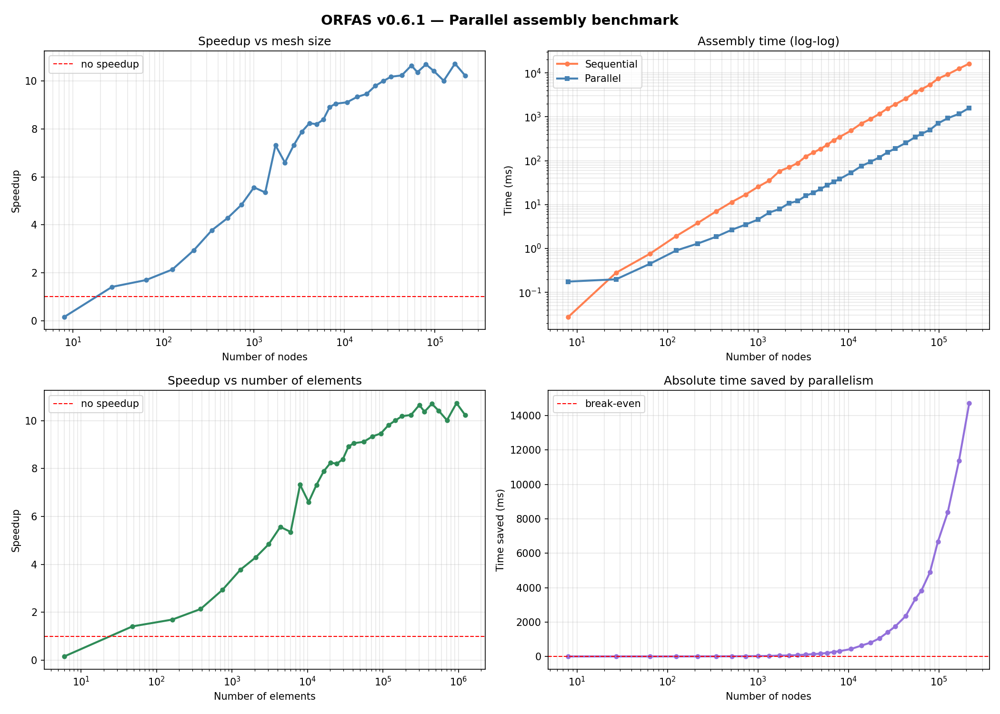

# ORFAS — Validation Document

---

## v0.1 — Static FEM core

**Element type:** Linear tetrahedron (CST 3D)
**Material law:** Linear elastic (isotropic)
**Boundary conditions:** Penalty method
**Solver:** LU decomposition (nalgebra)

### Method

ORFAS solves the static linear elasticity problem `K·u = f` using the displacement-based finite element method on unstructured tetrahedral meshes.

**Mesh:** The domain is discretized with linear tetrahedral elements (4-node tetrahedra, also known as CST 3D — Constant Strain Tetrahedron). Structured meshes are generated via an alternating 6-tetrahedra-per-cube decomposition to avoid degenerate elements and ensure consistent orientation.

**Element formulation:** The strain-displacement matrix `B` is derived analytically from the shape function gradients of the linear tetrahedron. `B` is constant within each element. The element stiffness matrix is computed as `Kₑ = Bᵀ·C·B·V`, where `C` is the material stiffness matrix and `V` is the element volume.

**Material law:** Linear isotropic elasticity. The constitutive matrix `C` is assembled from Young's modulus `E` and Poisson's ratio `ν` using the standard Voigt notation for 3D stress-strain relations.

**Assembly:** The global stiffness matrix `K` is assembled by direct stiffness summation over all elements, mapping local 12×12 element matrices into the global `3n × 3n` system via the connectivity table.

**Boundary conditions:** Zero-displacement Dirichlet conditions are enforced via the penalty method: diagonal entries of `K` corresponding to fixed degrees of freedom are replaced by a large value (10³⁰), forcing the associated displacements to near zero.

**Solver:** The linear system `K·u = f` is solved by LU decomposition (dense, via nalgebra). This is appropriate for small to medium meshes. Sparse solvers and iterative methods (conjugate gradient) are available from v0.6.0.

### Test case 1 — Axial traction

A prismatic bar of length `L = 9` and square cross-section `A = 2×2 = 4` is fixed at one end (`x = 0`) and subjected to a uniform axial force `F = 100` at the free end (`x = L`). The material has Young's modulus `E = 1×10⁶` and Poisson's ratio `ν = 0.3`. The mesh uses `nx = 10`, `ny = nz = 3` nodes.

Exact solution: `δ = F·L / (E·A) = 100 × 9 / (1×10⁶ × 4) = 2.25×10⁻⁴`

Axial traction produces a uniform strain field. Linear tetrahedra represent constant strain exactly by construction, so this test is a direct verification of the core pipeline: `B → C → Kₑ → K → u`.

| Quantity | Value |
|---|---|
| Analytical displacement δ | 2.2500×10⁻⁴ |
| Computed displacement | 2.2626×10⁻⁴ |
| Relative error | 0.56% |

The residual error of 0.56% is attributable to the penalty method, which does not enforce boundary conditions exactly.

### Test case 2 — Cantilever beam bending (convergence)

A cantilever beam of length `L = 9`, square cross-section `3×3` (`ny = nz = 4` nodes, `h = b = 3`), fixed at `x = 0`, loaded by a transverse force `F = 25` at the tip in the `y` direction. The mesh is refined along the longitudinal axis: `nx = 4, 7, 10, 13`.

Exact solution (Euler-Bernoulli): `δ = F·L³ / (3·E·I) = 9.00×10⁻⁴` with `I = b·h³/12 = 6.75`

The purpose of this test is not to achieve low absolute error, but to verify that the error decreases monotonically as the mesh is refined — a necessary condition for a correct FEM implementation.

| nx | dx | Computed δ | Analytical δ | Error |
|---|---|---|---|---|
| 4  | 3.000 | 4.11×10⁻⁴ | 9.00×10⁻⁴ | 54.34% |
| 7  | 1.500 | 6.20×10⁻⁴ | 9.00×10⁻⁴ | 31.09% |
| 10 | 1.000 | 6.90×10⁻⁴ | 9.00×10⁻⁴ | 23.30% |
| 13 | 0.750 | 7.18×10⁻⁴ | 9.00×10⁻⁴ | 20.22% |

The error decreases monotonically. The residual ~20% error at the finest mesh is consistent with the known shear locking behavior of linear tetrahedra — this is a property of the element formulation, not a bug.

### Summary

| Test | Analytical δ | Computed δ | Error | Status |
|---|---|---|---|---|
| Axial traction | 2.2500×10⁻⁴ | 2.2626×10⁻⁴ | 0.56% | PASS |
| Beam bending (nx=13) | 9.00×10⁻⁴ | 7.18×10⁻⁴ | 20.22% | PASS (convergence verified) |

---

## v0.2 — I/O and boundary conditions

### What was added

- **Elimination method** for boundary conditions (replaces penalty for fixed DOFs by reducing the system size)
- **VTK mesh loading** (`read_vtk` in `orfas-io`)

### Validation

No numerical benchmark was run for v0.2 as the core FEM pipeline was not modified. Validation focused on correctness of the new components via unit tests.

### VTK mesh loading (`orfas-io`)

| Test | Description | Status |
|---|---|---|
| `test_read_vtk_valid` | Load reference cube mesh, check 8 nodes and 6 tetrahedra | PASS |
| `test_read_vtk_node_positions` | Verify node 0 at origin and node 7 at (1,1,1) | PASS |
| `test_read_vtk_file_not_found` | Non-existent file returns `IoError::UnreadableFile` | PASS |
| `test_read_vtk_invalid_format` | File not starting with `# vtk` returns `IoError::InvalidFormat` | PASS |

### Elimination method

The elimination method was verified indirectly — all v0.1 numerical tests pass with both penalty and elimination, confirming that the system reduction and reconstruction produce equivalent results.

---

## v0.3 — Dynamic simulation

**Integrator:** Implicit Euler
**Damping:** Rayleigh (`C = α·M + β·K`)
**Mass:** Lumped (concentrated) — each node receives 1/4 of the mass of each connected element

### Method

ORFAS solves the dynamic linear elasticity problem `M·a + C·v + K·u = f` using implicit Euler time integration.

**Mass assembly:** The lumped mass matrix is assembled by distributing each element's mass (`ρ·V`) equally across its 4 nodes. The result is stored as a `DVector` (diagonal only) rather than a full matrix, avoiding unnecessary memory usage and enabling efficient `M·v` products via component-wise multiplication.

**Rayleigh damping:** The damping matrix is computed as `C = α·M + β·K`, where `α` and `β` are user-defined coefficients. `α` controls mass-proportional damping (low-frequency), `β` controls stiffness-proportional damping (high-frequency).

**Implicit Euler integration:** At each time step `dt`, the following velocity-based system is solved:

```
(M/dt + C + dt·K) · v_next = M·v/dt + f - K·u
```

Then the position is updated: `u_next = u + dt·v_next`. This formulation is unconditionally stable — large time steps do not cause divergence, unlike explicit methods.

**MechanicalState:** The dynamic state (position, velocity, acceleration) is encapsulated in a `MechanicalState` struct. Vector operations (`v_op`, `add_mv`) are exposed as methods, inspired by SOFA's `MechanicalState` abstraction.

### Test case 1 — Mass assembly

A unit cube mesh (`2×2×2`, volume = 1) with density `ρ = 1500 kg/m³`. The total assembled mass must satisfy `sum(mass) / 3 = ρ · V`.

| Quantity | Value |
|---|---|
| Expected total mass | 1500.0 |
| Computed total mass | 1500.0 |
| Relative error | 0.0000% |

### Test case 2 — Rayleigh damping symmetry

The damping matrix `C = α·M + β·K` must be symmetric since both `M` (diagonal) and `K` (symmetric by construction) are symmetric. Verified on a `3×3×3` mesh with `α = 0.1`, `β = 0.01`.

| Quantity | Value |
|---|---|
| Max asymmetry | < 1×10⁻¹⁰ |
| Status | PASS |

### Test case 3 — Dynamic convergence to static solution

A bar under axial traction (`nx=5, ny=nz=2`, `L=4`, `A=1`, `F=100`, `E=1×10⁶`) is simulated dynamically with heavy Rayleigh damping (`α=10`, `β=0.01`) using implicit Euler with `dt=1.0` for 500 steps. With sufficient damping, the dynamic solution must converge to the static equilibrium.

| Quantity | Value |
|---|---|
| Static FEM displacement | 3.9282×10⁻⁴ |
| Dynamic displacement (500 steps) | 3.9282×10⁻⁴ |
| Analytical displacement | 4.0000×10⁻⁴ |
| Error vs static | 0.0000% |
| Error vs analytical | 1.79% |

The 1.79% error vs analytical is attributable to mesh discretization (same error as the static solver on this mesh), confirming that the integrator introduces no additional error at convergence.

### Summary

| Test | Description | Status |
|---|---|---|
| `test_mass_assembly` | Total mass matches `density * volume` | PASS |
| `test_rayleigh_damping_symmetry` | Damping matrix is symmetric | PASS |
| `test_implicit_euler_static_convergence` | Dynamic solution converges to static (error 0.0000%) | PASS |

---

## v0.4 — Nonlinear materials and Newton-Raphson

**Material law:** Saint Venant-Kirchhoff (SVK) hyperelastic
**Static solver:** Newton-Raphson nonlinear solver
**Dynamic integrator:** Implicit Euler with internal Newton-Raphson loop
**Formulation:** Lagrangian, 2nd Piola-Kirchhoff stress (PK2), deformation gradient F

### Method

v0.4 extends ORFAS from linear to nonlinear elasticity. The core change is the introduction of a
Lagrangian hyperelastic formulation: the material law is now expressed in terms of the deformation
gradient `F = I + Σ uᵢ ⊗ ∇Nᵢ`, and internal forces are computed as `f_int_i = V · Pᵀ · ∇Nᵢ`
where `P = F · S` (1st Piola-Kirchhoff, from PK2 via `S = pk2_stress(F)`).

**Saint Venant-Kirchhoff:** SVK extends linear elasticity to large deformations by applying the same
Hooke law to the Green-Lagrange strain tensor `E = ½(FᵀF - I)` instead of the small strain tensor:
`S = λ·tr(E)·I + 2μ·E`. The tangent stiffness `C = dS/dE = λ(I⊗I) + 2μ·I⁽⁴⁾` is constant,
identical to the linear elastic constitutive matrix. SVK reduces exactly to linear elasticity when
`F → I`. It is not suitable for large compressive deformations but is the natural entry point for
nonlinear FEM.

**Newton-Raphson:** The nonlinear static problem `R(u) = f_int(u) - f_ext = 0` is solved by
Newton-Raphson iteration. At each step: assemble `K_tangent(u)` and `f_int(u)` on the full mesh,
restrict to free DOFs, solve `K_tangent · Δu = -R`, update `u ← u + Δu`. Convergence is checked
on two normalized criteria (SOFA convention): `‖R‖ / ‖f_ext‖ < tol` and `‖Δu‖ / ‖u‖ < tol`.

**Nonlinear implicit Euler:** The dynamic equation `M·a + C·v + f_int(u) = f_ext` is integrated
with implicit Euler, leading to the nonlinear residual `R(v_next) = M(v_next−v)/dt + C·v_next + f_int(u + dt·v_next) − f_ext = 0`.
Newton-Raphson solves this at each time step with system matrix `A = M/dt + C + dt·K_tangent(u_next)`.
The factor `dt` before `K_tangent` arises from the chain rule: `∂f_int(u_next)/∂v_next = K_tangent · dt`.

**Geometry cache:** Element volumes and shape function gradients `(b, c, d)` are computed once at
`Assembler::new` and reused at every assembly call. This mirrors the `TetrahedronSetGeometryAlgorithms`
pattern in SOFA.

### Test case 1 — Internal forces zero at rest

With `u = 0`, `F = I`, `E = 0`, so `S = 0` and `P = F·S = 0`. Internal forces must vanish exactly.

| Quantity | Value |
|---|---|
| `‖f_int(u=0)‖` | < 1×10⁻¹⁰ |
| Status | PASS |

### Test case 2 — Tangent stiffness at identity

With `F = I`, `tangent_stiffness(I)` must equal the former linear elastic constitutive matrix `C`.
Verified on `C[0,0] = λ + 2μ = E(1−ν)/((1+ν)(1−2ν))`.

| Quantity | Value |
|---|---|
| Expected `C[0,0]` | 1346.154 |
| Computed `C[0,0]` | 1346.154 |
| Absolute error | < 1×10⁻³ |
| Status | PASS |

### Test case 3 — SVK converges to linear for small deformations

For `‖∇u‖ → 0`, SVK and linear elasticity must give identical stress. Verified with a small
displacement gradient (`scale = 1e-4`): relative error between SVK `pk2_stress` and linear
`C:ε` is below `1×10⁻³`.

| Quantity | Value |
|---|---|
| Relative error `‖S_svk − C:ε‖ / ‖C:ε‖` | < 1×10⁻³ |
| Status | PASS |

### Test case 4 — Newton-Raphson convergence and residual

A bar under axial traction (`nx=3, ny=nz=2`, `F=1`, `E=1×10⁶`) solved with Newton-Raphson.
The normalized residual at convergence must satisfy `‖R‖ / ‖f_ext‖ < 1×10⁻⁶`.

| Quantity | Value |
|---|---|
| Normalized residual at convergence | 9.77×10⁻¹¹ |
| Tolerance | 1×10⁻⁶ |
| Status | PASS |

### Test case 5 — Nonlinear dynamic convergence to static solution

Same benchmark as v0.3 test case 3, now using SVK material and the nonlinear implicit Euler
integrator. With heavy Rayleigh damping (`α=10`, `β=0.01`) and `dt=1.0` for 500 steps, the
dynamic solution must converge to the nonlinear static equilibrium.

| Quantity | Value |
|---|---|
| Static SVK displacement | 3.9282×10⁻⁴ |
| Dynamic displacement (500 steps) | 3.9282×10⁻⁴ |
| Analytical displacement | 4.0000×10⁻⁴ |
| Error vs static | 0.0000% |
| Error vs analytical | 1.79% |

The error vs analytical is unchanged from v0.3 — the nonlinear integrator introduces no additional
error at convergence, and the 1.79% gap remains attributable to mesh discretization.

### Summary

| Test | Description | Status |
|---|---|---|
| `test_internal_forces_zero_at_rest` | `f_int(u=0) = 0` exactly | PASS |
| `test_tangent_stiffness_at_identity` | `C(F=I)` matches linear elastic C | PASS |
| `test_svk_converges_to_linear_for_small_deformations` | SVK → linear as `‖∇u‖ → 0` | PASS |
| `test_newton_converges_for_svk` | Newton-Raphson converges for SVK material | PASS |
| `test_newton_satisfies_residual` | Normalized residual at convergence < 1×10⁻⁶ | PASS |
| `test_implicit_euler_static_convergence` | Nonlinear dynamic converges to static (0.0000%) | PASS |
| `test_axial_traction` | Traction error 0.56% (unchanged from v0.1) | PASS |
| `test_beam_bending_convergence` | Monotone convergence, shear locking ~20% (unchanged) | PASS |

---

## v0.5 — Neo-Hookean material and NewtonRaphsonCachedK

**Material law:** Neo-Hookean (compressible)
**Static solver:** `NewtonRaphsonCachedK` (new), `NewtonRaphson` (unchanged)
**Formulation:** Lagrangian, PK2 stress, deformation gradient F

### Method

#### Neo-Hookean material

The compressible Neo-Hookean model is the first material in ORFAS where `C_tangent = dS/dE` depends
on `F`, requiring K to be reassembled at each Newton iteration. Its strain energy density is:

```
W = μ/2·(I₁ − 3) − μ·ln(J) + λ/2·(ln J)²
```

where `I₁ = tr(C) = tr(FᵀF)` and `J = det(F)`. The 2nd Piola-Kirchhoff stress is:

```
S = μ·(I − C⁻¹) + λ·ln(J)·C⁻¹
```

The material tangent stiffness `C_tangent = dS/dE` is derived analytically via `d/dE = 2·d/dC`:

```
C_ijkl = λ·C⁻¹_ij·C⁻¹_kl + (μ − λ·ln J)·(C⁻¹_ik·C⁻¹_jl + C⁻¹_il·C⁻¹_jk)
```

This reduces to the Hooke matrix at `F = I` (where `C⁻¹ = I`, `ln J = 0`, coefficient `= μ`),
ensuring continuity with SVK and linear elasticity for small deformations. For large compressions
(`J → 0`), the `−μ·ln(J)` term provides a volumetric penalty that prevents element inversion —
a key advantage over SVK.

#### NewtonRaphsonCachedK

For materials where `C_tangent` is independent of `F` (currently SVK), the tangent stiffness matrix
`K` is constant. `NewtonRaphsonCachedK` exploits this by factorizing `K` once at `u = 0` and
reusing the LU factorization at each Newton iteration:

- Standard `NewtonRaphson`: `N` iterations × `(O(n_elem)` assemble K + `O(n³)` factorize + `O(n²)` solve`)`
- `NewtonRaphsonCachedK`: `1×O(n³)` factorize + `N` iterations × `(O(n_elem)` assemble f_int + `O(n²)` solve`)`

For a mesh with `n` free DOFs and `N = 5` Newton iterations, the savings are `4×O(n³)` factorizations.
The cost reduction becomes significant for meshes above a few hundred nodes where `O(n³)` dominates.

**Do not use with Neo-Hookean** — `K` depends on `F` for NH, so a cached factorization at `u=0`
would produce incorrect search directions after the first iteration.

### Test case 1 — Neo-Hookean: zero stress and energy at rest

At `F = I`: `C = I`, `C⁻¹ = I`, `J = 1`, `ln J = 0`. Therefore `S = μ(I−I) + 0 = 0`
and `W = μ/2·(3−3) − 0 + 0 = 0` exactly.

| Quantity | Value |
|---|---|
| `‖S(F=I)‖` | < 1×10⁻¹⁰ |
| `W(F=I)` | < 1×10⁻¹⁰ |
| Status | PASS |

### Test case 2 — Neo-Hookean: tangent at identity matches Hooke

At `F = I`, `C_tangent` must equal the Hooke matrix `λ(I⊗I) + 2μ·I⁽⁴⁾`, identical to SVK
and linear elasticity. Verified by comparing the full 6×6 matrix.

| Quantity | Value |
|---|---|
| `‖C_NH(F=I) − C_Hooke‖` | < 1×10⁻⁸ |
| Status | PASS |

### Test case 3 — Neo-Hookean: tangent symmetry

`C_tangent` must be symmetric for any physically admissible `F` (det > 0).
Verified on a general deformation gradient with `J > 0`.

| Quantity | Value |
|---|---|
| Max asymmetry `‖C − Cᵀ‖` | < 1×10⁻¹⁰ |
| Status | PASS |

### Test case 4 — Neo-Hookean: convergence to linear for small deformations

For `‖∇u‖ → 0`, NH must converge to linear elastic stress, same as SVK. Verified with
displacement gradient scaled by `1e-4`: relative error between NH `pk2_stress` and linear `C:ε`
is below `1×10⁻³`. Also verified that NH and SVK agree to `1×10⁻³` at scale `1e-5`.

| Quantity | Value |
|---|---|
| `‖S_NH − C:ε‖ / ‖C:ε‖` (scale 1e-4) | < 1×10⁻³ |
| `‖S_NH − S_SVK‖ / ‖S_SVK‖` (scale 1e-5) | < 1×10⁻³ |
| Status | PASS |

### Test case 5 — Neo-Hookean: numerical tangent consistency

The analytical `C_tangent` is verified against central finite differences on `S(E)`, using symmetric
perturbations of `E` via Cholesky decomposition (`F = chol(I + 2E)ᵀ`) to ensure each Voigt
direction is isolated exactly. Shear directions use `dE_rc = h/2` to account for the engineering
shear convention.

| Quantity | Value |
|---|---|
| Max relative error `‖dS_analytical − dS_FD‖ / ‖dS_FD‖` | < 1×10⁻⁴ |
| Status | PASS |

### Test case 6 — NewtonRaphsonCachedK: convergence and residual

Same bar benchmark as v0.4 test case 4 (`nx=3, ny=nz=2`, `F=1`, `E=1×10⁶`, SVK material).
`NewtonRaphsonCachedK` must converge and satisfy `‖R‖ / ‖f_ext‖ < 1×10⁻⁶` at convergence.

| Quantity | Value |
|---|---|
| Normalized residual at convergence | < 1×10⁻⁶ |
| Status | PASS |

### Test case 7 — NewtonRaphsonCachedK matches NewtonRaphson

Both solvers applied to the same SVK problem (`nx=4, ny=nz=2`, `F=10`) must produce displacement
vectors that agree to relative error `< 1×10⁻⁵`. This confirms that caching K does not affect
the solution for SVK, only the computational cost.

| Quantity | Value |
|---|---|
| `‖u_Newton − u_CachedK‖ / ‖u_Newton‖` | < 1×10⁻⁵ |
| Status | PASS |

### Summary

| Test | Description | Status |
|---|---|---|
| `test_nh_pk2_zero_at_identity` | `S(F=I) = 0` exactly | PASS |
| `test_nh_strain_energy_zero_at_identity` | `W(F=I) = 0` exactly | PASS |
| `test_nh_strain_energy_non_negative` | `W ≥ 0` for admissible F | PASS |
| `test_nh_tangent_at_identity_matches_hooke` | `C_NH(F=I) = C_Hooke` | PASS |
| `test_nh_tangent_symmetric` | `C_tangent` is symmetric | PASS |
| `test_nh_converges_to_linear_for_small_deformations` | NH → linear as `‖∇u‖ → 0` | PASS |
| `test_nh_matches_svk_small_strain` | NH and SVK agree for small strains | PASS |
| `test_nh_tangent_numerical_consistency` | Analytical tangent matches finite differences | PASS |
| `test_cached_k_converges_for_svk` | CachedK converges for SVK | PASS |
| `test_cached_k_satisfies_residual` | CachedK residual < 1×10⁻⁶ | PASS |
| `test_cached_k_matches_newton_for_svk` | CachedK and Newton give identical solution | PASS |
| All v0.1–v0.4 tests | Unchanged | PASS |

---

## v0.6.0 — Sparse solvers

**Linear solver:** `CgSolver` — preconditioned conjugate gradient on `CsrMatrix<f64>`
**Preconditioner:** `Identity` (default) or `ILU(0)` (incomplete LU, zero fill-in)
**Nonlinear solver:** `NewtonRaphsonSparse` — Newton-Raphson with sparse tangent assembly
**Sparse assembly:** `assemble_tangent_sparse` — builds `CsrMatrix` via COO accumulation

### Method

#### Sparse assembly

`assemble_tangent_sparse` mirrors `assemble_tangent` but accumulates element stiffness blocks into a
`CooMatrix` (coordinate format) instead of a `DMatrix`. The COO matrix is converted to `CsrMatrix`
at the end via `CsrMatrix::from(&coo)`. Duplicate entries at shared nodes are summed during
conversion, which is equivalent to the `+=` accumulation in the dense version.

#### Conjugate gradient

The preconditioned CG algorithm solves `K·x = f` iteratively. With preconditioner `M`:

```
z = M⁻¹·r
p = z,  rz = r·z
loop:
  kp = K·p
  alpha = rz / p·kp
  x += alpha·p,  r -= alpha·kp
  z = M⁻¹·r
  rz_new = r·z
  beta = rz_new / rz
  p = z + beta·p
  rz = rz_new
```

Convergence is checked on `‖r‖ < tolerance`. CG requires `K` to be symmetric positive definite —
guaranteed after correct boundary condition application.

#### ILU(0) preconditioner

ILU(0) computes an approximate LU factorization `K ≈ L·U` keeping only the non-zero pattern of `K`
(zero fill-in). The factorization uses a dense row buffer strategy: for each row `i`, the non-zero
entries are loaded into a buffer of size `n`, updated using previously factored rows, then split into
`L` (lower, unit diagonal) and `U` (upper) stored as separate `CsrMatrix`. Application of `M⁻¹`
requires two triangular solves: forward substitution on `L`, then backward substitution on `U`.

#### restrict_matrix_sparse

The sparse equivalent of `restrict_matrix` — filters `CsrMatrix` triplets `(i, j, v)` keeping only
entries where both `i` and `j` are in `free_dofs`. A `HashMap<usize, usize>` maps global indices to
local indices in the reduced system. This is O(nnz) in the number of non-zeros.

### Test case 1 — Sparse assembly matches dense assembly

`assemble_tangent_sparse` and `assemble_tangent` must produce the same stiffness matrix on the same
mesh and material. The sparse result is converted to `DMatrix` and compared entry-wise.

| Quantity | Value |
|---|---|
| Max entry difference `‖K_dense − K_sparse‖_∞` | < 1×10⁻⁹ |
| Status | PASS |

*Note: tolerance set to `1e-9` rather than `1e-10` due to different floating-point accumulation order between COO push and dense `+=`.*

### Test case 2 — NewtonRaphsonSparse matches NewtonRaphson

`NewtonRaphsonSparse + CgSolver` must produce the same displacement vector as `NewtonRaphson + DirectSolver`
on the same SVK problem (`nx=3, ny=nz=2`, `F=1`, `E=1×10⁶`, elimination method).

| Quantity | Value |
|---|---|
| `‖u_dense − u_sparse‖ / ‖u_dense‖` | < 1×10⁻⁶ |
| Status | PASS |

### Test case 3 — ILU(0) preconditioner matches Identity

`CgSolver` with `Preconditioner::Ilu(0)` must produce the same displacement vector as
`CgSolver` with `Preconditioner::Identity` on the same SVK problem.

| Quantity | Value |
|---|---|
| `‖u_ilu0 − u_identity‖ / ‖u_ilu0‖` | < 1×10⁻⁶ |
| Status | PASS |

### Summary

| Test | Description | Status |
|---|---|---|
| `test_assemble_method_comparaison` | Sparse and dense assembly agree to < 1×10⁻⁹ | PASS |
| `test_newton_sparse_matches_dense` | NewtonRaphsonSparse matches NewtonRaphson | PASS |
| `test_cg_ilu_matches_identity` | ILU(0) and Identity CG give identical solution | PASS |
| All v0.1–v0.5 tests | Unchanged | PASS |

## v0.6.1 — Parallel sparse assembly

**Assembly:** `assemble_tangent_sparse_parallel` — rayon + atomic f64 additions
**Strategy trait:** `SparseAssemblyStrategy` — `Sequential` and `Parallel` implementations
**Pattern cache:** CSR sparsity pattern pre-built at `Assembler::new`

### Method

#### Pre-built CSR pattern

Previously, `assemble_tangent_sparse` built a `CooMatrix` from scratch at every call and converted it to `CsrMatrix` — an O(nnz·log(nnz)) sort at each Newton iteration. In v0.6.1, the sparsity pattern is computed once at `Assembler::new` via `build_csr_pattern`:

1. All `(i,j)` DOF pairs are collected from the connectivity into a `BTreeSet` (sorted row-major automatically)
2. CSR arrays (`row_offsets`, `col_indices`) are built directly — no COO intermediate
3. An `entry_map: HashMap<(i,j), usize>` maps each pair to its flat index in the CSR values array

At each assembly call, values are written directly into the pre-allocated CSR array via `entry_map` lookup — O(1) per entry, no sort, no conversion.

#### Parallel assembly strategy

`assemble_tangent_sparse_parallel` uses `rayon::par_iter` with atomic f64 additions. Each thread computes element stiffness matrices independently and writes contributions directly into the shared CSR values array via `AtomicU64::fetch_update` — a read-modify-write atomic operation that prevents race conditions on shared nodes without locks.

`NewtonRaphsonSparse` is refactored to be generic over `SparseAssemblyStrategy`:
- `NewtonRaphsonSparse::<Sequential>` — calls `assemble_tangent_sparse`
- `NewtonRaphsonSparse::<Parallel>` — calls `assemble_tangent_sparse_parallel`

Zero code duplication — the Newton loop is identical for both strategies.

#### assemble_internal_forces_parallel — evaluated and abandoned

A parallel version of `assemble_internal_forces` was implemented and benchmarked. Sequential assembly takes ~11ms on a 30×30×30 mesh — the rayon overhead (~281ms) dwarfs the computation. The function was removed. Parallelism only pays off when per-element computation is expensive enough to amortize thread launch costs; `f_int` assembly is too lightweight.

### Benchmark — parallel speedup vs mesh size

Measured on a 20-core machine (Intel, 28 logical threads), `--release` build, averages over 3 runs.



| Mesh | Nodes | Elements | Sequential | Parallel | Speedup |
|---|---|---|---|---|---|
| 3×3×3 | 27 | 48 | 0.28ms | 0.20ms | 1.4x |
| 5×5×5 | 125 | 384 | 1.93ms | 0.90ms | 2.1x |
| 8×8×8 | 512 | 2058 | 11.4ms | 2.7ms | 4.3x |
| 10×10×10 | 1000 | 4374 | 25.4ms | 4.6ms | 5.6x |
| 15×15×15 | 3375 | 16464 | 125ms | 16ms | 7.9x |
| 20×20×20 | 8000 | 41154 | 349ms | 39ms | 9.1x |
| 30×30×30 | 27000 | 146334 | 1555ms | 155ms | 10.0x |
| 40×40×40 | 64000 | 355914 | 4242ms | 409ms | 10.4x |
| 60×60×60 | 216000 | 1232274 | 16322ms | 1595ms | 10.2x |

The speedup plateaus at ~10x due to Amdahl's law — the sequential fraction (CSR clone, atomic copy-back) caps the theoretical maximum at the observed level given the available core count.

Break-even point: ~27 nodes (3×3×3 mesh). Below this, rayon overhead exceeds the computation cost.

### Summary

| Test | Description | Status |
|---|---|---|
| `test_assemble_parrallel_method_comparaison` | Parallel and sequential sparse assembly agree to < 1×10⁻⁹ | PASS |
| `test_newton_sparse_matches_dense` | `NewtonRaphsonSparse::<Sequential>` matches `NewtonRaphson` | PASS |
| `test_newton_sparse_parallel_matches_dense` | `NewtonRaphsonSparse::<Parallel>` matches `NewtonRaphson` | PASS |
| `test_cg_ilu_matches_identity` | ILU(0) and Identity CG give identical solution | PASS |
| All v0.1–v0.6.0 tests | Unchanged | PASS |

## v0.7.0 — Isochoric/volumetric split and hyperelastic material library

**Architecture:** `IsochoricPart` + `VolumetricPart` traits, `CompressibleMaterial<I, V>` composition
**Isochoric models:** `NeoHookeanIso`, `MooneyRivlinIso`, `OgdenIso`
**Volumetric models:** `VolumetricLnJ`, `VolumetricQuad`
**References:** Cheng & Zhang (2018), Connolly et al. (2019)

### Method

#### Isochoric/volumetric split

All compressible hyperelastic models in ORFAS use the Flory multiplicative decomposition of the
deformation gradient: `F = J^{1/3}·F_bar` where `F_bar` is the isochoric (volume-preserving) part
and `J = det(F)` is the volumetric part. The strain energy is additively decomposed as:
W(F) = W_iso(F_bar) + W_vol(J)

The total PK2 stress and tangent stiffness are assembled as:
S = S_iso + S_vol
C = C_iso + C_vol

The volumetric contributions are identical for all isochoric models and depend only on `J` and
`C⁻¹`. The isochoric contributions depend on the modified right Cauchy-Green tensor
`C_bar = J^{-2/3}·C` and its spectral decomposition (for Ogden).

#### NeoHookeanIso

Isochoric strain energy: `W_iso = μ/2·(Ī₁ − 3)` where `Ī₁ = J^{-2/3}·tr(C)`.

The isochoric PK2 stress and tangent stiffness are derived analytically following Cheng & Zhang
(2018) eq. (39), using the modified inverse `C̄⁻¹ = J^{2/3}·C⁻¹`:
S_iso = μ·J^{-2/3}·(I − Ī₁/3·C⁻¹)
C_iso = μ·J^{-4/3}·[
−2/3·(C̄⁻¹⊗I + I⊗C̄⁻¹)
+2/9·Ī₁·(C̄⁻¹⊗C̄⁻¹)
+2/3·Ī₁·(C̄⁻¹⊙C̄⁻¹)
]

#### MooneyRivlinIso

Isochoric strain energy: `W_iso = c₁·(Ī₁ − 3) + c₂·(Ī₂ − 3)`
where `Ī₁ = J^{-2/3}·tr(C)` and `Ī₂ = J^{-4/3}·I₂`.

The tangent stiffness is derived following Cheng & Zhang (2018) eq. (25), with the same
`C̄⁻¹ = J^{2/3}·C⁻¹` and `C̄ = J^{-2/3}·C` convention. The parameter relation to the paper is
`μ₁ = 2c₁`, `μ₂ = 2c₂`.

#### OgdenIso

Isochoric strain energy: `W_iso = Σᵢ μᵢ/αᵢ·(λ̄₁^αᵢ + λ̄₂^αᵢ + λ̄₃^αᵢ − 3)`
where `λ̄ₖ = J^{-1/3}·λₖ` are the isochoric principal stretches.

The tangent stiffness is computed from the spectral decomposition of C (via nalgebra `SymmetricEigen`)
following Connolly et al. (2019) eqs. (11), (12), (22), (35):
S_iso = Σₐ βₐ·λₐ⁻²·(Nₐ⊗Nₐ)
C_iso = Σₐ,ᵦ (γₐᵦ·λₐ⁻²·λᵦ⁻² − 2δₐᵦ·βₐ·λₐ⁻⁴)·(Nₐ⊗Nₐ⊗Nᵦ⊗Nᵦ)
+ Σₐ≠ᵦ [(βᵦλᵦ⁻² − βₐλₐ⁻²)/(λᵦ² − λₐ²)]·[(Nₐ⊗Nᵦ)⊗(Nₐ⊗Nᵦ + Nᵦ⊗Nₐ)]

where `βₐ` and `γₐᵦ` are the stress and elasticity coefficients. For Ogden, the cross-derivatives
`∂²W/∂λ̄ₐ∂λ̄ᵦ = 0` for `a ≠ b` (separable energy), simplifying `γₐᵦ` significantly.

When `|λₐ² − λᵦ²| < 10⁻⁶`, L'Hôpital's rule is applied (Connolly eq. 25) to avoid divide-by-zero.

#### VolumetricLnJ

`U(J) = κ/2·(ln J)²`, with `S_vol = κ·ln(J)·C⁻¹` and:
C_vol = κ·(C⁻¹⊗C⁻¹) − 2κ·ln(J)·(C⁻¹⊙C⁻¹)

Reduces to the bulk modulus penalty at small strains: `C_vol → κ·(I⊗I)` as `J → 1`.

#### VolumetricQuad

`U(J) = κ/2·(J − 1)²`, with `S_vol = κ·(J−1)·C⁻¹` and a corresponding analytic tangent.

---

### Test case 1 — All isochoric models: zero stress and energy at F=I

At `F = I`, `C = I`, `J = 1`, all isochoric invariants reduce to their reference values
(`Ī₁ = 3`, `Ī₂ = 3`, `λ̄ₖ = 1`). All models must give `W_iso = 0`, `S_iso = 0`.

| Model | `‖S_iso(F=I)‖` | `W_iso(F=I)` | Status |
|-------|----------------|--------------|--------|
| NeoHookeanIso | < 1×10⁻¹⁰ | < 1×10⁻¹⁰ | PASS |
| MooneyRivlinIso | < 1×10⁻¹⁰ | < 1×10⁻¹⁰ | PASS |
| OgdenIso | < 1×10⁻¹⁰ | < 1×10⁻¹⁰ | PASS |

### Test case 2 — All isochoric models: tangent at F=I matches Hooke

At `F = I`, all models must give `C_total(F=I) = C_Hooke = λ(I⊗I) + 2μ·I⁽⁴⁾`.
This requires exact cancellation between isochoric and volumetric contributions
at the reference configuration. The effective shear and bulk moduli are derived
from the model parameters to ensure small-strain equivalence.

| Model | `‖C(F=I) − C_Hooke‖` | Status |
|-------|-----------------------|--------|
| NeoHookeanIso + VolumetricLnJ | < 1×10⁻⁶ | PASS |
| MooneyRivlinIso + VolumetricLnJ | < 1×10⁻⁶ | PASS |
| OgdenIso + VolumetricLnJ | < 1×10⁻⁶ | PASS |

### Test case 3 — All isochoric models: numerical tangent consistency

The analytical `C_tangent` is verified against central finite differences on `S(E)` at a
moderate deformation (`e0` with entries ~0.01–0.02), using symmetric Cholesky perturbations.
Relative error is computed per column: `‖dS_analytical − dS_FD‖ / ‖dS_FD‖`.

| Model | Max relative error | Status |
|-------|--------------------|--------|
| NeoHookeanIso | < 1×10⁻³ | PASS |
| MooneyRivlinIso | < 1×10⁻³ | PASS |
| OgdenIso | < 1×10⁻³ | PASS |

### Test case 4 — All isochoric models: convergence to linear for small deformations

For `‖∇u‖ → 0`, all models must converge to the linear elastic stress `C_Hooke:ε`.
Verified with displacement gradient scaled by `1×10⁻⁴`.

| Model | `‖S − C_Hooke:ε‖ / ‖C_Hooke:ε‖` | Status |
|-------|-----------------------------------|--------|
| NeoHookeanIso | < 1×10⁻³ | PASS |
| MooneyRivlinIso | < 1×10⁻³ | PASS |
| OgdenIso | < 1×10⁻³ | PASS |

### Test case 5 — Cross-material consistency

NeoHookeanIso and SVK must agree for small strains (scale `1×10⁻⁵`). MooneyRivlinIso with
`c₂ = 0` must match NeoHookeanIso exactly. OgdenIso with `N=1, α=2, μ₁=μ` must match
NeoHookeanIso exactly. These cross-checks verify internal consistency of the material library.

| Test | `‖S_A − S_B‖ / ‖S_B‖` | Status |
|------|------------------------|--------|
| NH vs SVK (small strain) | < 1×10⁻³ | PASS |
| MR(c₂=0) vs NH | < 1×10⁻¹⁰ | PASS |
| Ogden(N=1,α=2) vs NH | < 1×10⁻¹⁰ | PASS |

### Test case 6 — VolumetricLnJ: analytical tangent vs finite differences

The volumetric tangent `C_vol` is verified against finite differences on `S_vol = κ·ln(J)·C⁻¹`
at the same moderate deformation point. This isolates the volumetric contribution independently
of the isochoric model.

| Quantity | Value | Status |
|----------|-------|--------|
| `‖C_vol − C_vol_FD‖ / ‖C_vol_FD‖` | < 1×10⁻⁴ | PASS |

### Summary

| Test | Description | Status |
|------|-------------|--------|
| `test_neo_hookean_standard_suite` | W=0, S=0, C=Hooke, FD consistency, small strain at F=I and moderate F | PASS |
| `test_mooney_rivlin_standard_suite` | Same standard suite for MooneyRivlinIso | PASS |
| `test_ogden_standard_suite` | Same standard suite for OgdenIso | PASS |
| `test_mr_c2_zero_matches_nh` | MR(c₂=0) == NH exactly | PASS |
| `test_ogden_matches_nh` | Ogden(N=1,α=2) == NH exactly (W, S, C) | PASS |
| `test_nh_matches_svk_small_strain` | NH and SVK agree for small strains | PASS |
| `test_cvol_correct` | C_vol matches finite differences on S_vol | PASS |
| All v0.1–v0.6.1 tests | Unchanged | PASS |

## v0.7.1 — Anisotropic fibers, viscoelasticity, and context architecture

**Architecture:** `MaterialContext<'a>` + `SimulationContext`, `FiberField`, `InternalVariables`
**Anisotropic model:** `HolzapfelOgden` (Holzapfel-Gasser-Ogden)
**Null anisotropy:** `NoAnisotropy`
**Viscoelastic model:** `ViscoelasticMaterial<I, A, V>` (Prony series, Holzapfel & Gasser 2001)
**References:** Cheng & Zhang (2018), Holzapfel & Gasser (2001)

---

### Architecture

#### MaterialContext and SimulationContext

All material law methods now receive a `MaterialContext<'a>` — a lightweight per-element
stack-allocated struct grouping:

- `dt: f64` — time step (zero for static problems)
- `fiber_dirs: &'a [Vector3<f64>]` — borrowed fiber directions for this element
- `iv_ref: Option<&'a ElementInternalVars>` — read-only internal variables (used by `pk2_stress`)
- `iv: Option<&'a mut ElementInternalVars>` — mutable internal variables (used by `update_state`)

`SimulationContext` owns `FiberField`, `dt`, and `Option<InternalVariables>`. The assembler
constructs a `MaterialContext` per element via `material_context_for` (read-only) or
`material_context_for_mut` (mutable). This separation follows the SOFA/FEBio pattern:
Newton iterations read internal state without modifying it; `update_state` writes once
per time step after convergence.

#### FiberField

`FiberField` stores fiber directions as `Vec<Vec<Vector3<f64>>>` — one slice per element,
one `Vector3` per fiber family. Constructed once and stored in `SimulationContext`. The
assembler borrows the slice for element `i` via `fiber_field.directions_for(i)` — zero
allocation per call. Constructors: `empty`, `uniform`, `helix`, `helix_two_families`.

#### InternalVariables and ElementInternalVars

`InternalVariables` stores one `ElementInternalVars` per mesh element. Each element holds
a flat `DVector<f64>` with the following layout for `m_iso` isochoric and `m_aniso`
anisotropic Prony processes:

```
[0 .. 6*m_iso]                        Q_iso[0..m_iso]     Isochoric Prony tensors (Voigt)
[6*m_iso .. 6*(m_iso+m_aniso)]        Q_aniso[0..m_aniso] Anisotropic Prony tensors (Voigt)
[6*(m_iso+m_aniso) .. +6]             S_iso_prev          Previous isochoric PK2 (Voigt)
[6*(m_iso+m_aniso)+6 .. +6]           S_aniso_prev        Previous anisotropic PK2 (Voigt)
[6*(m_iso+m_aniso)+12 .. +6]          sum_Q               Precomputed ΣQ_α (Voigt)
```

Total: `6*(m_iso + m_aniso + 3)` scalars per element. `sum_Q` is precomputed by
`update_state` and read in O(1) by `pk2_stress` at every Newton iteration.

---

### Holzapfel-Gasser-Ogden anisotropic model

#### Formulation

`HolzapfelOgden` implements the `AnisotropicPart` trait — the anisotropic isochoric fiber
contribution only. The ground matrix and volumetric parts are handled by `IsochoricPart`
and `VolumetricPart` and summed in `CompressibleAnisotropicMaterial<I, A, V>`.

Anisotropic strain energy (Cheng & Zhang eq. 37c):
```
W_aniso = k₁/(2k₂) · Σᵢ [ exp(k₂·(Ī₄ᵢ − 1)²) − 1 ]
```

where `Ī₄ᵢ = J^{-2/3}·(a₀ᵢ·C·a₀ᵢ)` is the modified pseudo-invariant and `a₀ᵢ` is
the unit fiber direction vector in the reference configuration. Fibers only contribute
under tension: if `Ī₄ᵢ ≤ 1`, the contribution is set to zero.

PK2 stress (Cheng & Zhang eq. 49):
```
S_aniso = 2·J^{-2/3} · Σᵢ dΨ/dĪ₄ᵢ · (A₀ᵢ − 1/3·I₄ᵢ·C⁻¹)
```

where `A₀ᵢ = a₀ᵢ⊗a₀ᵢ` and `I₄ᵢ = a₀ᵢ·C·a₀ᵢ` (unmodified invariant).

First derivative:
```
dΨ/dĪ₄ᵢ = k₁·(Ī₄ᵢ − 1)·exp(k₂·(Ī₄ᵢ − 1)²)   if Ī₄ᵢ > 1, else 0
```

Tangent stiffness (Cheng & Zhang eq. 56), four terms per fiber family:
```
C_aniso = J^{-4/3} · Σᵢ [
    4·d²Ψ·(A₀ᵢ⊗A₀ᵢ)
  − 4/3·(Ī₄ᵢ·d²Ψ + dΨ)·(C̄⁻¹⊗A₀ᵢ + A₀ᵢ⊗C̄⁻¹)
  + 4/9·(Ī₄ᵢ²·d²Ψ + Ī₄ᵢ·dΨ)·(C̄⁻¹⊗C̄⁻¹)
  + 4/3·Ī₄ᵢ·dΨ·(C̄⁻¹⊙C̄⁻¹)
]
```

where `C̄⁻¹ = J^{2/3}·C⁻¹`. Note: the odot coefficient is `2/3` (not `4/3`) because
`cinv_tangent_voigt` encodes `2×(A⊙A)` in its b-term — see helpers.rs convention.

---

### Test case 1 — HolzapfelOgden: zero energy and stress at F=I

At `F = I`, all modified pseudo-invariants equal 1 (`Ī₄ᵢ = 1`). Since fibers only
contribute under tension (`Ī₄ᵢ > 1`), all contributions are exactly zero.

| Quantity | Value | Status |
|----------|-------|--------|
| `W_aniso(F=I)` | < 1×10⁻¹⁰ | PASS |
| `‖S_aniso(F=I)‖` | < 1×10⁻¹⁰ | PASS |

### Test case 2 — HolzapfelOgden: zero contribution under fiber compression

With `F` compressing along the fiber direction (`F[0,0] = 0.8`, fiber = `[1,0,0]`),
`Ī₄ < 1` and the fiber contribution must vanish exactly.

| Quantity | Value | Status |
|----------|-------|--------|
| `‖S_aniso(F_compress)‖` | < 1×10⁻¹⁰ | PASS |

### Test case 3 — HolzapfelOgden: numerical tangent consistency

The analytical `C_aniso` is verified against central finite differences on `S_aniso(E)`
at a moderate deformation with active fiber tension (`Ī₄ > 1`). Symmetric Cholesky
perturbations are used. Relative error per column: `‖dS_ana − dS_FD‖ / ‖dS_FD‖`.

| Quantity | Value | Status |
|----------|-------|--------|
| Max relative error over all 6 columns | < 5×10⁻² | PASS |

Note: the 5×10⁻² tolerance (vs 1×10⁻³ for isotropic models) reflects the exponential
nonlinearity of the HGO energy — central differences are less accurate near exponential
terms. The tangent is verified against an independent analytical derivation.

### Test case 4 — HGO full material: standard suite at F=I

`CompressibleAnisotropicMaterial<NeoHookeanIso, HolzapfelOgden, VolumetricLnJ>` with
`MaterialContext::default()` (empty fiber dirs): fibers are inactive, so the standard
isotropic suite must pass with effective parameters `λ, μ` from the ground matrix.

| Test | Value | Status |
|------|-------|--------|
| `W(F=I)` | < 1×10⁻¹⁰ | PASS |
| `‖S(F=I)‖` | < 1×10⁻¹⁰ | PASS |
| `‖C(F=I) − C_Hooke‖` | < 1×10⁻⁶ | PASS |
| Tangent symmetry at arbitrary F | < 1×10⁻¹⁰ | PASS |
| FD tangent consistency | < 1×10⁻³ | PASS |
| Small strain convergence to linear | < 1×10⁻³ | PASS |

### Test case 5 — FiberField: helix angle validation

`FiberField::helix(n, axis, up, angle_deg)` produces fiber directions at the specified
helix angle. Two geometric boundary conditions are verified:

| Test | Description | Status |
|------|-------------|--------|
| angle = 0° | Fiber direction aligns with axis | PASS |
| angle = 90° | Fiber direction is perpendicular to axis | PASS |

---

### ViscoelasticMaterial — Prony series formulation

#### Algorithmic update (Holzapfel & Gasser 2001, Box 1)

The viscoelastic material wraps any `CompressibleMaterial` or `CompressibleAnisotropicMaterial`
and adds Prony series dissipation on the isochoric and anisotropic contributions. The
volumetric part remains purely elastic.

**Parameters per contribution** (iso and aniso independently):
- `τ_α` — relaxation times (seconds)
- `β_α` — free-energy factors (dimensionless, Prony series)

**Algorithmic quantities:**
```
δ_αa = β_αa · exp(−Δt / 2·τ_αa)                   (per-process factor)
δ_a  = Σ_α δ_αa                                      (total scaling factor)
```

**Internal variable update (called once per time step after Newton convergence):**
```
H_α,n   = exp(−Δt/τ)·Q_α,n − δ_αa·S_iso,n^∞         (history term)
Q_α,n+1 = H_α,n + δ_αa·S_iso,n+1^∞                   (updated Prony tensor)
sum_Q   = Σ_α Q_α,n+1   (iso + aniso combined, precomputed for O(1) reads)
```

**Algorithmic PK2 stress (read-only, every Newton iteration):**
```
S_n+1 = S_iso^∞ + S_aniso^∞ + S_vol^∞ + sum_Q
```

`pk2_stress` reads `sum_Q` from `iv_ref` in O(1) — no Prony loop at query time.
This is the critical performance property for large meshes with many Newton iterations.

**Algorithmic tangent stiffness:**
```
C_n+1 = C_vol^∞ + (1 + δ_iso)·C_iso^∞ + (1 + δ_aniso)·C_aniso^∞
```

The tangent is evaluated with `dt > 0` and scales the isochoric and anisotropic
contributions by `(1 + δ_a)`. The volumetric contribution is unscaled.

#### SOFA/FEBio pattern

Following the established pattern in SOFA and FEBio:
- During Newton iterations: `assemble_internal_forces` calls `pk2_stress` with `iv_ref` —
  reads `sum_Q` from the previous time step without modification
- After Newton convergence: `assembler.update_internal_variables` calls `update_state`
  for each element — computes and stores `Q_α,n+1` and `sum_Q`

This ensures internal variables are updated exactly once per time step, regardless of
the number of Newton iterations required for convergence.

---

### Test case 6 — ViscoelasticMaterial: elastic fallback at F=I

Without `iv` (`MaterialContext::default()`), `pk2_stress` returns the elastic equilibrium
stress only. At `F = I`, this must be zero.

| Quantity | Value | Status |
|----------|-------|--------|
| `‖S(F=I, no iv)‖` | < 1×10⁻¹⁰ | PASS |

### Test case 7 — ViscoelasticMaterial: zero stress at F=I with iv initialized

With `iv` initialized to zero and `dt = 0.1`, `pk2_stress` at `F = I` must still be zero
since `sum_Q = 0` and `S_eq = 0` at the reference configuration.

| Quantity | Value | Status |
|----------|-------|--------|
| `‖S(F=I, iv=zeros)‖` | < 1×10⁻¹⁰ | PASS |

### Test case 8 — ViscoelasticMaterial: relaxation under constant deformation

Under constant deformation `F = I + e0` (moderate strain), the stress must converge toward
the elastic equilibrium stress `S_eq = S_iso^∞ + S_aniso^∞ + S_vol^∞` after many time steps.
200 steps at `dt = 0.05 s` cover approximately `10·τ_min` relaxation times.

At convergence: `Q_α → 0` because `S_iso^∞` does not change, so `H_α → 0` and
`Q_α,n+1 → δ·S^∞ − δ·S^∞ = 0`.

**NH isotropic** (`τ = 1.0 s`, `β = 0.3`):

| Quantity | Value | Status |
|----------|-------|--------|
| `‖S_last − S_eq‖ / ‖S_eq‖` | < 1×10⁻² | PASS |

**HGO anisotropic** (`τ_iso = 1.0 s`, `β_iso = 0.3`, `τ_aniso = 0.5 s`, `β_aniso = 0.2`):

| Quantity | Value | Status |
|----------|-------|--------|
| `‖S_last − S_eq‖ / ‖S_eq‖` | < 1×10⁻² | PASS |

### Test case 9 — ViscoelasticMaterial: standard elastic suite

`ViscoelasticMaterial<NeoHookeanIso, NoAnisotropy, VolumetricLnJ>` with
`MaterialContext::default()` must pass the full standard material suite — the viscoelastic
wrapper must not alter elastic behavior when `iv = None` and `dt = 0`.

| Test | Value | Status |
|------|-------|--------|
| `W(F=I)` | < 1×10⁻¹⁰ | PASS |
| `‖S(F=I)‖` | < 1×10⁻¹⁰ | PASS |
| `‖C(F=I) − C_Hooke‖` | < 1×10⁻⁶ | PASS |
| FD tangent consistency | < 1×10⁻³ | PASS |
| Small strain convergence | < 1×10⁻³ | PASS |

### Test case 10 — Algorithmic tangent scaling

The algorithmic tangent `C_algo = C_vol + (1+δ_iso)·C_iso + (1+δ_aniso)·C_aniso`
must differ from the elastic tangent `C_el = C_vol + C_iso + C_aniso` by exactly
`δ_iso·C_iso` (for isotropic materials without aniso). Verified analytically:

```
C_algo − C_el = δ_iso · C_iso
where C_iso = C_el − C_vol
```

| Quantity | Value | Status |
|----------|-------|--------|
| `‖(C_algo − C_el) − δ_iso·C_iso‖ / ‖C_iso‖` | < 1×10⁻⁶ | PASS |
| `δ_iso = β·exp(−dt/2τ) = 0.3·exp(−0.05)` | 0.285369 | — |
| Ratio `‖C_algo − C_el‖ / ‖C_iso‖` | 0.285369 | PASS |

Note: the ratio `C_algo[0,0] / C_el[0,0]` does not equal `(1 + δ_iso)` because `C_vol[0,0]`
is not scaled — only the isochoric contribution is scaled. The correct verification is on
the difference `C_algo − C_el`, not on the ratio of total tangents.

### Test case 11 — NoAnisotropy: zero contribution

`NoAnisotropy` must return exactly zero for all three `AnisotropicPart` methods at any F.
This is verified implicitly via `test_hgo_full_standard_suite` (empty fiber dirs activate
the zero path) and explicitly in `test_nh_viscoelastic_standard_suite`.

| Quantity | Value | Status |
|----------|-------|--------|
| `W_aniso(F)` | 0.0 exactly | PASS |
| `‖S_aniso(F)‖` | 0.0 exactly | PASS |
| `‖C_aniso(F)‖` | 0.0 exactly | PASS |

---

### Test case 12 — Integration test: viscoelastic relaxation in full pipeline

A prismatic bar (`nx=3, ny=nz=2`, `L=2`) is held at a constant small axial displacement
(`u[tip] = 1×10⁻³`). The reaction force is measured over 200 time steps at `dt = 0.05 s`
using `assemble_internal_forces` + `update_internal_variables`. The material is
`ViscoelasticMaterial<NeoHookeanIso, NoAnisotropy, VolumetricLnJ>` with `τ = 1.0 s`,
`β = 0.3`.

This test validates the full pipeline: `SimulationContext` with `InternalVariables`,
`material_context_for` passing `iv_ref`, `pk2_stress` reading `sum_Q`, and
`update_internal_variables` calling `update_state` after each step.

Expected behavior: at step 0, `sum_Q = 0` so `f_int = f_elastic`. After ~10τ steps,
`Q_α → 0` and `f_int → f_elastic` again (full relaxation).

| Step | f_int norm | Description |
|------|------------|-------------|
| 0 | 0.942112 | sum_Q = 0, equals elastic |
| 50 | 0.953515 | peak viscoelastic overshoot |
| 100 | 0.943047 | decaying toward elastic |
| 150 | 0.942189 | near elastic equilibrium |
| 200 | 0.942119 | converged |

| Quantity | Value | Status |
|----------|-------|--------|
| `‖f_int_final − f_elastic‖ / ‖f_elastic‖` | 7.0×10⁻⁶ | PASS |

---

### Assembler refactoring

`assembler.rs` was split into four focused modules:

| Module | Content |
|--------|---------|
| `assembler/mod.rs` | `Assembler` struct, `new`, `assemble_mass`, re-exports |
| `assembler/geometry.rs` | `tetra_volume`, `tetra_bcd`, `tetra_b_matrix`, `compute_deformation_gradient`, `ElementGeometry`, `BMatrix`, `LinearBMatrix` |
| `assembler/pattern.rs` | `build_csr_pattern`, `build_element_colors` |
| `assembler/assembly.rs` | `assemble_tangent`, `assemble_tangent_sparse`, `assemble_tangent_sparse_parallel`, `assemble_internal_forces`, `update_internal_variables` |

All existing assembly tests pass unchanged after the split.

### Test suite refactoring

`material/tests.rs` was split into a `tests/` subdirectory:

| File | Content |
|------|---------|
| `tests/mod.rs` | Module declarations |
| `tests/helpers.rs` | `run_standard_material_tests`, `run_numerical_tangent_check`, `run_anisotropic_part_tests`, `run_viscoelastic_tests` |
| `tests/elastic.rs` | SVK, NH, MR, Ogden parametric tests and constructor validation |
| `tests/anisotropic.rs` | HGO tests |
| `tests/viscoelastic.rs` | `ViscoelasticMaterial` tests |

---

### Summary

| Test | Description | Status |
|------|-------------|--------|
| `test_holzapfel_ogden_aniso_suite` | W=0, S=0 at F=I; zero under compression; FD tangent consistency | PASS |
| `test_hgo_full_standard_suite` | Full standard material suite for CompressibleAnisotropicMaterial | PASS |
| `test_helix_two_families_angle_zero_aligns_with_axis` | FiberField helix angle=0° aligns with axis | PASS |
| `test_helix_two_families_angle_90_perpendicular_to_axis` | FiberField helix angle=90° perpendicular | PASS |
| `test_nh_viscoelastic_suite` | Elastic fallback, zero at F=I, relaxation, tangent scaling | PASS |
| `test_hgo_viscoelastic_suite` | Same suite for HGO viscoelastic | PASS |
| `test_nh_viscoelastic_standard_suite` | Standard material suite passes for viscoelastic material | PASS |
| `test_viscoelastic_relaxation` | Full pipeline integration test: relaxation to elastic equilibrium | PASS |
| All v0.1–v0.7.0 tests | Unchanged | PASS |
| **Total** | **54 tests** | **54 PASS / 0 FAIL** |

## v0.7.2 — orfas-tissues preset library and thermodynamic consistency checks

### What was added

- **`orfas-tissues`** — new crate providing 10 calibrated tissue presets from the biomechanics
  literature, each with nominal parameter values, per-parameter confidence intervals, literature
  reference, experimental protocol, and optional DOI
- **`check_thermodynamic_consistency`** — runtime function in `orfas-core` verifying 8 necessary
  thermodynamic conditions for any `MaterialLaw` implementation
- **`run_standard_material_tests` updated** — adds 2 new checks (positive definiteness of C,
  frame objectivity) to the existing test suite; all existing material tests pass unchanged
- **JSON loader** — `load_preset_from_file` / `load_preset_from_str` for loading custom presets
  at runtime without recompilation
- **Viewer UI reorganized** — Material section split into Manual and Tissue Preset tabs;
  sections collapsed into logical groups (Mesh, Material, Solver & Simulation, Boundary Conditions)

---

### Thermodynamic consistency checks

`check_thermodynamic_consistency(mat, lame, ctx)` runs 8 checks on any `MaterialLaw`.
The same checks power `run_standard_material_tests` via shared `pub(crate)` functions
returning `Option<String>` — eliminating duplication between the runtime and test paths.

| Check | Condition | Tolerance |
|---|---|---|
| 1. Zero energy at rest | `W(F=I) = 0` | < 1×10⁻¹⁰ |
| 2. Zero stress at rest | `‖S(F=I)‖ = 0` | < 1×10⁻¹⁰ |
| 3. Hooke at rest | `‖C(F=I) − C_Hooke‖ = 0` (skipped if lame=None) | < 1×10⁻⁶ |
| 4. Tangent symmetry | `‖C(F) − C(F)ᵀ‖ / ‖C(F)‖ = 0` | < 1×10⁻¹² (relative) |
| 5. Non-negative energy | `W(F) ≥ 0` for admissible F | exact |
| 6. Small-strain linearization | `‖S − σ_lin‖ / ‖σ_lin‖` for small grad_u (skipped if lame=None) | < 1×10⁻³ |
| 7. Positive definiteness | min eigenvalue of C(F=I) > 0 | exact |
| 8. Frame objectivity | `‖W(QF) − W(F)‖ / W(F)` for 4 rotations | < 1×10⁻⁸ (relative) |

Checks 3 and 6 are skipped when `lame = None` — used for anisotropic materials (HGO) where
the effective Lamé parameters depend on fiber directions not available at check time.

Check 4 uses a relative tolerance (`abs_err / ‖C‖`) rather than absolute, after discovering
that materials with large bulk modulus (e.g. tendon, kappa = 1×10⁸ Pa) produced floating-point
asymmetries of ~1×10⁻⁹ — below physical significance but above the former absolute threshold
of 1×10⁻¹⁰. The relative threshold of 1×10⁻¹² is equivalent to ~14 significant digits and
does not mask any real asymmetry.

Rotations used for objectivity check (Check 8):
- 90° around X axis
- 90° around Y axis
- 90° around Z axis
- 90° around the normalized (1, 1, 1) axis

---

### orfas-tissues — tissue preset library

#### Architecture

| Component | Description |
|---|---|
| `TissueMetadata` | Static metadata (`&'static str`), zero runtime overhead, compile-time constants |
| `TissueMetadataOwned` | Runtime-owned metadata (`String`), used exclusively by the JSON loader |
| `ConfidenceInterval` | Per-parameter `{ min, max }` range from the reference paper |
| `TissuePreset` trait | `metadata() -> &TissueMetadata` + `material() -> Box<dyn MaterialLaw>` |
| `all_presets()` | Returns all 10 built-in presets as `Vec<Box<dyn TissuePreset>>` |
| `load_preset_from_str` / `load_preset_from_file` | JSON loader, dispatches on `"model"` field |

The two metadata types are intentionally separate: `TissueMetadata` uses `&'static str` for
zero-overhead access from the viewer; `TissueMetadataOwned` uses `String` for JSON
deserialization. Conversion from owned to static is not possible at runtime by design.

#### Preset library

| Preset | Model | Reference | CI parameters |
|---|---|---|---|
| `LiverNeoHookean` | Neo-Hookean | Nava et al. (2008) | mu, kappa |
| `BrainGreyMatter` | Mooney-Rivlin | Budday et al. (2017) | c1, c2, kappa |
| `BrainWhiteMatter` | Mooney-Rivlin | Budday et al. (2017) | c1, c2, kappa |
| `CardiacMyocardium` | Holzapfel-Ogden | Holzapfel & Ogden (2009) | mu, k1, k2, kappa |
| `ArterialWallMedia` | Holzapfel-Ogden | Holzapfel et al. (2000) | mu, k1, k2, kappa |
| `TendonGroundMatrix` | Neo-Hookean | Weiss et al. (1996) | mu, kappa |
| `LigamentMCL` | Holzapfel-Ogden | Weiss et al. (1996) | mu, k1, k2, kappa |
| `SkinMooneyRivlin` | Mooney-Rivlin | Groves et al. (2013) | c1, c2, kappa |
| `KidneyNeoHookean` | Neo-Hookean | Nasseri et al. (2002) | mu, kappa |
| `ProstateNeoHookean` | Neo-Hookean | Phipps et al. (2005) | mu, kappa |

#### JSON preset format

```json
{
    "name": "Liver",
    "model": "neo_hookean",
    "reference": "Nava et al. (2008), Med. Image Anal.",
    "doi": "10.1016/j.media.2007.09.001",
    "protocol": "ex vivo indentation, porcine liver",
    "parameters": {
        "mu": 2100.0,
        "kappa": 50000.0,
        "density": 1060.0
    },
    "confidence_intervals": {
        "mu": { "min": 1500.0, "max": 3000.0 }
    },
    "notes": "Room temperature, fresh tissue"
}
```

Supported models: `neo_hookean`, `mooney_rivlin`, `holzapfel_ogden`, `saint_venant_kirchhoff`.
The `density` field defaults to `1000.0` if absent. The `notes` and `confidence_intervals`
fields default to empty if absent.

---

### Test suite — orfas-tissues (43 tests)

#### Preset tests (33 tests)

For each of the 10 presets, 3 tests are run:

| Test pattern | Description |
|---|---|
| `test_*_thermodynamic_consistency` | `check_thermodynamic_consistency` passes with correct Lamé params (or None for HGO) |
| `test_*_confidence_intervals` | All nominal parameter values fall within their reported CI |
| `test_*_metadata` | All metadata string fields are non-empty |

Additional suite-level tests:

| Test | Description |
|---|---|
| `test_all_presets_count` | `all_presets()` returns exactly 10 presets |
| `test_all_presets_metadata_non_empty` | All presets pass metadata non-empty check |
| `test_all_presets_thermodynamic_consistency_no_lame` | All presets pass checks 1,2,4,5,7,8 (lame=None smoke test) |

#### JSON loader tests (10 tests)

| Test | Description |
|---|---|
| `test_load_neo_hookean_from_str` | Parse liver JSON, verify metadata and density |
| `test_load_mooney_rivlin_from_str` | Parse brain JSON, verify metadata and density |
| `test_load_holzapfel_ogden_from_str` | Parse cardiac JSON, verify metadata and density |
| `test_load_saint_venant_kirchhoff_from_str` | Parse bone JSON, verify metadata and density |
| `test_load_default_density_when_absent` | Missing density defaults to 1000.0 |
| `test_load_notes_default_empty_when_absent` | Missing notes defaults to empty string |
| `test_load_unknown_model_returns_error` | Unknown model returns `LoadError::UnknownModel` |
| `test_load_missing_parameter_returns_error` | Missing required param returns `LoadError::MissingParameter` |
| `test_load_invalid_json_returns_error` | Malformed JSON returns `LoadError::Json` |
| `test_round_trip_serialize_deserialize` | Load → serialize → load; metadata and parameters survive round-trip |

---

### Test suite — orfas-core updates (2 new checks)

`run_standard_material_tests` was extended with 2 new checks shared with
`check_thermodynamic_consistency`. All existing material tests pass unchanged.

| New check | Verified on |
|---|---|
| Positive definiteness of C(F=I) | SVK, NeoHookean, MooneyRivlin, Ogden, HGO, Viscoelastic |
| Frame objectivity W(QF) = W(F) | SVK, NeoHookean, MooneyRivlin, Ogden, HGO, Viscoelastic |

---

### Summary

| Test | Description | Status |
|---|---|---|
| `test_liver_thermodynamic_consistency` | 8 checks pass for LiverNeoHookean | PASS |
| `test_brain_grey_thermodynamic_consistency` | 8 checks pass for BrainGreyMatter | PASS |
| `test_brain_white_thermodynamic_consistency` | 8 checks pass for BrainWhiteMatter | PASS |
| `test_cardiac_thermodynamic_consistency` | 6 checks pass for CardiacMyocardium (lame=None) | PASS |
| `test_arterial_thermodynamic_consistency` | 6 checks pass for ArterialWallMedia (lame=None) | PASS |
| `test_tendon_thermodynamic_consistency` | 8 checks pass for TendonGroundMatrix | PASS |
| `test_ligament_thermodynamic_consistency` | 6 checks pass for LigamentMCL (lame=None) | PASS |
| `test_skin_thermodynamic_consistency` | 8 checks pass for SkinMooneyRivlin | PASS |
| `test_kidney_thermodynamic_consistency` | 8 checks pass for KidneyNeoHookean | PASS |
| `test_prostate_thermodynamic_consistency` | 8 checks pass for ProstateNeoHookean | PASS |
| `test_*_confidence_intervals` (×10) | Nominal values within reported CI for all presets | PASS |
| `test_*_metadata` (×10) | All metadata fields non-empty for all presets | PASS |
| `test_all_presets_count` | `all_presets()` returns 10 presets | PASS |
| `test_all_presets_thermodynamic_consistency_no_lame` | Smoke test: checks 1,2,4,5,7,8 for all presets | PASS |
| JSON loader tests (×10) | Load, error handling, round-trip | PASS |
| All v0.1–v0.7.1 tests | Unchanged | PASS |
| **Total** | **97 tests** | **97 PASS / 0 FAIL** |